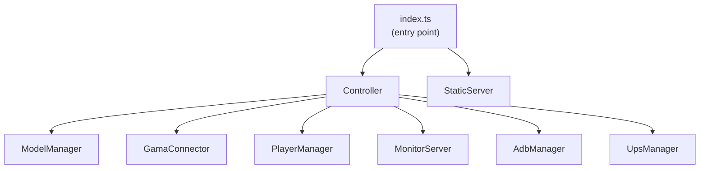

# WebPlatform Architecture

The WebPlatform (`simple.webplatform/`) is a TypeScript/Node.js application. In production it ships as a self-contained binary. In development it runs with `npm start`, which concurrently launches the Express/uWebSockets backend and the Vite dev server.

---

## Backend components

### index.ts — Entry point

Reads the `.env` file, configures the logging system (logtape), detects ADB availability, and creates the `Controller`. In packaged mode, also starts the `StaticServer` to serve the frontend.

### Controller

The central coordinator. It holds references to all other backend components and provides a unified API that the `MonitorServer` calls in response to frontend commands. It also coordinates cross-component workflows such as: on experiment launch, wait for GAMA confirmation, then add all waiting players.

The Controller also starts a 3-hour timer on startup. If the timer fires while the UPS is running on battery, it orchestrates a clean shutdown sequence: power off headsets via ADB, arm the UPS output cut, then shut down the host computer.

### ModelManager

On startup, scans all directories specified by `LEARNING_PACKAGE_PATH` and `EXTRA_LEARNING_PACKAGE_PATH` for `settings.json` files. Builds a flat `Model[]` list and a nested catalog structure for display in the frontend. Resolves relative `model_file_path` values to absolute paths.

### GamaConnector

WebSocket **client** that connects to the GAMA server. Formats and sends protocol messages (load, pause, play, stop, expression). Parses incoming messages and notifies the Controller of state changes. Reconnects automatically after 5 seconds on any abnormal closure or error.

### PlayerManager

WebSocket **server** (uWebSockets.js) listening on `HEADSET_WS_PORT`. Manages the player list (`Map<IP, Player>`). Handles connection, message routing, heartbeat, and disconnection. Sends targeted simulation output to each headset. Adds players to GAMA automatically when a simulation is running.

### MonitorServer

WebSocket **server** (uWebSockets.js) listening on `MONITOR_WS_PORT`. Accepts connections from the admin UI. Parses incoming commands and delegates to the Controller. Broadcasts `json_state` to all connected clients whenever GAMA or player state changes.

### AdbManager

Manages the ADB server connection (via `@yume-chan/adb`). Discovers headsets either from the `HEADSETS_IP` list or via network scan (`evilscan`). Sets up per-device ADB connections and launches scrcpy streams for screen mirroring.

### UpsManager

Connects to an APC UPS via USB HID (`node-hid`). Monitors battery/AC status. Used by the session timer to decide whether a shutdown sequence is needed.

### StaticServer

Express server that serves the compiled Vite frontend from the `dist/` directory. Only active in production mode or when running as a packaged executable.

---

## Frontend

The admin UI is a React 18 application built with Vite and styled with TailwindCSS. It communicates with the backend exclusively via WebSocket (port `MONITOR_WS_PORT`) through the `WebSocketManager` component. Redux manages global state.

Key frontend components:

| Component | Purpose |
|---|---|
| `WebSocketManager` | Maintains the WebSocket connection; dispatches state to Redux |
| `SimulationManager` | Experiment control panel (launch/pause/stop), headset list, per-headset controls |
| `SelectorSimulations` | Virtual Universe picker grid |
| `StreamPlayerScreen` | Passive grid of headset screen mirrors |
| `StreamFullscreen` | Single headset fullscreen mirror |
| `VideoStreamManager` | Decodes scrcpy H.264/H.265 streams using WebCodecs |

---

## Initialization sequence

1. `index.ts` loads `.env`, initializes logging.
2. If packaged, `StaticServer` starts serving the frontend.
3. `Controller` constructor:
 a. Creates `MonitorServer` (WebSocket server starts, port 8001).
 b. Creates `PlayerManager` (WebSocket server starts, port 8080).
 c. Unless `ENV_GAMALESS`: creates `ModelManager` (scans learning packages) and `GamaConnector` (attempts first GAMA connection).
 d. If ADB available: creates `AdbManager`.
 e. Creates `UpsManager`.
4. `Controller.initialize()`:
 a. `AdbManager.init()` — discovers and connects to headsets.
 b. `UpsManager.connect()` — attaches to UPS.
 c. Arms the 3-hour session timer.

---

## GAMALESS mode

Setting `ENV_GAMALESS=true` disables all GAMA-related components (`GamaConnector`, `ModelManager`). Only headset and player management remain active. This is useful for testing screen mirroring without a GAMA installation, or for deployments that only need the headset management features.

---

## Logging

The WebPlatform uses **logtape** with two sinks:

- **Console**: Level `info` (or `debug` with `VERBOSE=true`, or `trace` with `EXTRA_VERBOSE=true`).
- **File** (`errorLog.log`): Rotating file sink, max 100 MiB × 5 files. Uses `fingersCrossed` mode — buffers debug-level messages and flushes the buffer when an `error` or above is emitted, ensuring context for errors is always captured.
