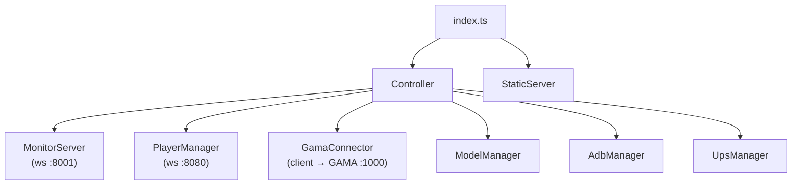

# Backend Modules

The WebPlatform backend is a Node.js/TypeScript application built on [uWebSockets.js](https://github.com/uNetworking/uWebSockets.js). This page describes each module's responsibilities and public interface.

For the WebSocket protocol these modules expose, see the [WebSocket API Reference](./websocket-api.md).

---

## Module overview



---

## Controller

**File**: `src/api/core/Controller.ts`

The central coordinator. Holds references to all other modules and provides a unified API that `MonitorServer` calls in response to frontend commands.

**Responsibilities**:

- Initializes and manages the lifecycle of all other modules.
- Coordinates cross-module workflows (e.g., on experiment launch: waits for GAMA confirmation, then adds all waiting players).
- Arms a 3-hour session timer; initiates clean shutdown if UPS is on battery when it fires.

**Public methods**:

| Method | Description |
|---|---|
| `restart()` | Closes and recreates PlayerManager, GamaConnector, MonitorServer, ModelManager. |
| `getSimulationInformations()` | Returns the nested catalog JSON from ModelManager. |
| `notifyMonitor()` | Broadcasts current GAMA + player state to all monitor clients. |
| `broadcastSimulationOutput(json)` | Forwards GAMA simulation output to the targeted player headsets. |
| `addInGamePlayer(id)` | Asks GamaConnector to add a player to the running simulation. |
| `purgePlayer(id)` | Removes a player from GAMA, PlayerManager, and notifies the monitor. |
| `launchExperiment()` | Sends load command to GAMA; polls until running; adds all waiting players. |
| `stopExperiment()` | Stops the GAMA experiment and removes all players. |
| `pauseExperiment(callback?)` | Pauses the GAMA experiment. |
| `resumeExperiment()` | Resumes a paused GAMA experiment. |
| `sendExpression(id, expr)` | Sends a GAML expression to GAMA on behalf of a player. |
| `sendAsk(json)` | Sends a GAML ask statement to GAMA. |

---

## MonitorServer

**File**: `src/api/monitoring/MonitorServer.ts`

WebSocket **server** (uWebSockets.js) on `MONITOR_WS_PORT` (default 8001). The admin UI connects here.

**Responsibilities**:

- Broadcasts `json_state` to all connected clients on any state change.
- Parses incoming commands and delegates to Controller.
- Sends targeted responses (catalog list, simulation settings) to the requesting client only.

**Handled incoming message types**: `launch_experiment`, `stop_experiment`, `pause_experiment`, `resume_experiment`, `add_player_headset`, `remove_player_headset`, `get_simulation_informations`, `get_simulation_by_index`, `send_simulation`, `screen_control`, `try_connection`.

**Idle timeout**: 30 seconds (uWS default).

---

## PlayerManager

**File**: `src/api/multiplayer/PlayerManager.ts`

WebSocket **server** (uWebSockets.js) on `HEADSET_WS_PORT` (default 8080). VR headsets (Unity apps) connect here.

**Data structure**:

```typescript
playerList: Map<string, Player>
// key = headset IP address (string)
```

```typescript
interface Player {
 id: string; // player name (from "connection" message)
 ws: uWS.WebSocket<unknown>; // live WebSocket handle
 ping_interval: number; // heartbeat interval in ms
 is_alive: boolean; // cleared on ping, set on pong
 timeout?: NodeJS.Timeout; // heartbeat timer handle
 connected: boolean;
 in_game: boolean;
 date_connection: string; // "HH:MM" format
}
```

**Responsibilities**:

- Accepts and tracks headset WebSocket connections keyed by IP address.
- Routes `expression` and `ask` messages to GamaConnector.
- Sends heartbeat pings; terminates dead sockets.
- Routes targeted simulation output (`json_output`) to individual headsets.
- Automatically adds a connecting headset to the GAMA simulation if one is running.

**Reconnection**: If a headset with a known IP reconnects (e.g. after a brief WiFi drop), the existing player entry is updated in-place without re-registering with GAMA.

**Aggressive disconnect**: When `AGGRESSIVE_DISCONNECT=true`, the player entry is deleted from `playerList` on disconnect instead of being kept with `connected: false`.

---

## GamaConnector

**File**: `src/api/simulation/GamaConnector.ts`

WebSocket **client** that connects to the GAMA server at `ws://<GAMA_IP_ADDRESS>:<GAMA_WS_PORT>`.

**State tracked**:

```typescript
interface GamaState {
 connected: boolean;
 experiment_state: string; // NONE | NOTREADY | RUNNING | PAUSED
 loading: boolean;
 content_error: string;
 experiment_id: string;
 experiment_name: string;
}
```

**Responsibilities**:

- Formats and sends GAMA protocol messages (`load`, `play`, `pause`, `stop`, `expression`).
- Parses incoming messages (`SimulationStatus`, `SimulationOutput`, `CommandExecutedSuccessfully`, error types).
- On `SimulationOutput`: parses `message.content` and calls `controller.broadcastSimulationOutput()`.
- On error types (see `GAMA_ERROR_MESSAGES` constant): logs error and sets `content_error` in state.
- Reconnects automatically 5 seconds after any abnormal closure or connection error.

**Message queue**: Messages are queued in `listMessages[]` and flushed on the next `sendMessages()` call. A callback may be passed to run after all messages are sent.

---

## ModelManager

**File**: `src/api/simulation/ModelManager.ts`

Scans learning package directories and builds the catalog of available Virtual Universes.

**Responsibilities**:

- Scans `LEARNING_PACKAGE_PATH` and `EXTRA_LEARNING_PACKAGE_PATH` for directories containing `settings.json`.
- Parses each `settings.json` as either `json_settings` (a single model) or `catalog` (a nested folder of models).
- Resolves relative `model_file_path` values to absolute paths.
- Maintains a flat `models: Model[]` list (indexed by `model_index`) and a nested `monitorNestedModels` structure for the frontend.

**Settings format**: see [Virtual Universe settings reference](/webplatform/virtual-universes/settings).

**Error handling in packaged mode**: If no learning packages are found, the process exits with code 1.

---

## Model

**File**: `src/api/simulation/Model.ts`

Immutable representation of one Virtual Universe.

| Getter | Returns |
|---|---|
| `getModelFilePath()` | Absolute path to the `.gaml` file |
| `getExperimentName()` | GAMA experiment name to launch |
| `getJsonSettings()` | The full `VU_MODEL_SETTING_JSON` object |

---

## AdbManager

**File**: `src/api/android/adb/AdbManager.ts`

Manages ADB connections to Meta Quest headsets.

**Prerequisites**: `adb` must be installed and in PATH; `adb devices` must succeed.

**Responsibilities**:

- Connects to the local ADB server at `127.0.0.1:5037` via `@yume-chan/adb`.
- Discovers headsets via `DeviceFinder` (explicit IPs from `HEADSETS_IP` or network scan via `evilscan`).
- Sets device-level ADB settings (WiFi watchdog, sleep timeouts, OTA disable) via `HeadsetSetup`.
- Launches screen mirroring (`ScrcpyServer`) per device.
- Shuts down all headsets during the session timer cleanup sequence.

---

## UpsManager

**File**: `src/api/infra/ups/UpsManager.ts`

Monitors an APC UPS via USB HID (`node-hid`).

**Responsibilities**:

- Connects to the first recognized APC UPS device.
- Tracks battery/AC status.
- `isOnAC()`: returns `true` if running on mains power.
- `armShutdown(seconds)`: schedules UPS output cut after the given delay (used in the session timer shutdown sequence).

---

## StaticServer

**File**: `src/api/infra/StaticServer.ts`

Express HTTP server that serves the compiled React frontend from `dist/`. Only started when `NODE_ENV=production` or when running as a packaged executable.

---

## Constants

**File**: `src/api/core/Constants.ts`

### `GAMA_ERROR_MESSAGES`

```typescript
const GAMA_ERROR_MESSAGES = [
 "SimulationStatusError",
 "SimulationErrorDialog",
 "SimulationError",
 "RuntimeError",
 "GamaServerError",
 "MalformedRequest",
 "UnableToExecuteRequest"
];
```

GamaConnector treats any incoming message whose `type` matches an entry in this array as an error.

### `HEADSET_COLOR`

Maps the last octet(s) of a headset's IP address to a CSS color name. Used to assign a colored border to the headset's screen mirror in the admin UI, and to select the matching `headset_<color>.png` icon. The `101` → `blue`, `102` → `green`, etc. mapping is used by M2L2 deployments with fixed IP assignments.
