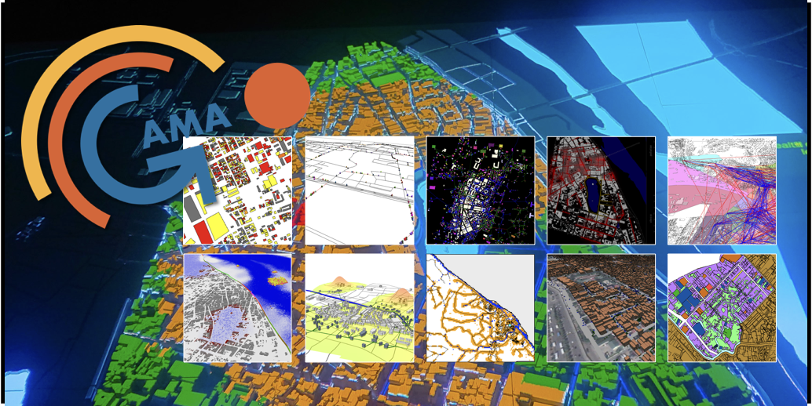

# GAMA Setup

GAMA is the simulation platform that runs Virtual Universes. This guide covers installation and configuration for use with SIMPLE.



## Requirements

- **Version:** GAMA 2025.06 or later (with JDK)
- **Download:** [GitHub Releases](https://github.com/gama-platform/gama/releases/tag/2025.06.4)

## Installation

1. Download the GAMA installer for your operating system.
2. Follow the [official installation guide](https://gama-platform.org/wiki/Installation).
3. Launch GAMA to verify installation.

<!-- TODO: Add screenshot of GAMA welcome screen -->
<!-- Screenshot description: GAMA platform main window showing the IDE interface with the welcome panel. -->

## Configure Network Settings

The WebPlatform communicates with GAMA via WebSocket on port 1000 by default.

1. Open GAMA.
2. Go to **Support → Preferences → Network → Server Mode**.
3. You can change the port if needed (default: `1000`).

:::note
GAMA binds to all interfaces by default, so the server port is accessible on any IP address of the machine.
:::

<!-- TODO: Add screenshot of GAMA Network Preferences -->
<!-- Screenshot description: GAMA Preferences window showing Network/Server Mode settings with Address and Port fields. -->

:::info
Ensure these settings match your WebPlatform's `.env` file:
- `GAMA_IP_ADDRESS` (default: `localhost`) — change this if GAMA runs on a different machine than the WebPlatform.
- `GAMA_WS_PORT` (default: `1000`)

See the [.env Reference](/webplatform/configuration) for details.
:::

## Install the SIMPLE Plugin

The SIMPLE plugin adds VR capabilities to GAMA (`abstract_unity_linker`, `abstract_unity_player`, `VR_Experiment`, and related operators).

1. In GAMA, go to **Support → Install new plugins...**
2. Click **Work with** and enter the update site URL:
  ```
 https://project-simple.github.io/simple.toolchain/
  ```
3. Press **Enter**. Select **SIMPLE Unity plugin** from the list.
4. Click **Next** and follow the prompts to install, then restart GAMA.

After restarting, a **UnityVR** menu appears in the GAMA IDE.

For more detail on the plugin's GAML API, see the [GAMA Plugin overview](/gama/installation).

## Verify Connection

1. Start the WebPlatform (`npm start`).
2. Ensure GAMA is running.
3. The WebPlatform connects to GAMA automatically and shows a connected state in the admin UI.

If the connection fails, check:
- GAMA is fully started and not showing errors.
- Firewall allows connections on port 1000 (or your configured port).
- `GAMA_IP_ADDRESS` in `.env` matches the machine running GAMA.

## Troubleshooting

| Problem | Solution |
|---|---|
| Can't connect | Verify GAMA is fully started before launching the WebPlatform |
| Port in use | Change the port in GAMA preferences and update `.env` |
