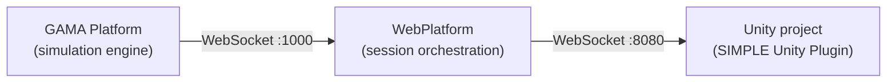

# Quick Start

SIMPLE requires three software components running at the same time. This page explains
what each one does, how they connect, and what you need to install to get started as a
Virtual Universe creator.

---

## The Three Components

| Component | What it does | Where it runs |
|---|---|---|
| **GAMA** | Runs the `.gaml` simulation model and exposes a WebSocket server | Operator's computer |
| **WebPlatform** | Relays between GAMA and Unity and serves the admin UI | Operator's computer |
| **Unity project with SIMPLE Unity Plugin** | Receives simulation data from WebPlatform and renders the Unity/VR scene | Unity Editor for development or Meta Quest headset for deployment |

All three must be running and connected for a live session to work. Getting only the
WebPlatform up is not enough.

---

## What You Need to Install

| Component | Tool | Guide |
|---|---|---|
| GAMA + SIMPLE plugin | GAMA 2025.06 or later | [GAMA setup](/gama/installation) |
| WebPlatform | Node.js 22 or later | [WebPlatform install](/webplatform/installation) |
| Unity + SIMPLE Unity Plugin | Unity 6000.3.2f1 | [Unity setup](/unity/setup) |
| Headset connectivity | ADB, optional for development | [ADB setup](/webplatform/installation#android-debug-bridge-adb) |

---

## Startup Sequence

Once everything is installed, a typical development session goes like this:

1. **Start GAMA.** Open the GAML model you want to test.
2. **Start the WebPlatform.** Run `npm start` from the WebPlatform project. The admin
   UI is served at `http://localhost:8000`.
3. **Open Unity.** Open a Unity project that has the SIMPLE Unity Plugin installed.
4. **Prepare the scene.** Use **GAMA > GAMA Panel > Default Setup** if the scene has
   not been prepared yet.
5. **Validate Play Mode.** Press **Play** in Unity while GAMA and WebPlatform are
   running.
6. **Generate a preview.** Use **Generate Preview from GAMA** to inspect and tune the
   scene in Edit Mode.

:::tip
For development, run Unity in the Editor. You can test the full GAMA, WebPlatform, and
Unity pipeline without a physical headset.
:::

---

## Next Steps

Work through the installation pages in order:

1. [Install GAMA and the SIMPLE plugin](/gama/installation)
2. [Install the WebPlatform](/webplatform/installation)
3. [Install Unity and the SIMPLE Unity Plugin](/unity/installation)
4. [Prepare the Unity scene](/unity/setup)
5. [Run a model in Unity](/unity/how-to/Running-a-model-game)
