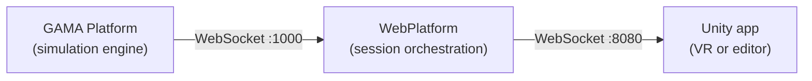

# Quick Start

SIMPLE requires three software components running at the same time. This page explains what each one does, how they connect, and what you need to install to get started as a Virtual Universe creator.

---

## The three components

| Component | What it does | Where it runs |
|---|---|---|
| **GAMA** | Runs the `.gaml` simulation model; exposes a WebSocket server | Operator's computer |
| **WebPlatform** | Relays between GAMA and Unity; serves the admin UI | Operator's computer |
| **Unity app** | Receives simulation data from the WebPlatform and renders the VR scene | Meta Quest headset — or Unity Editor for development |

All three must be running and connected for a session to work. Getting only the WebPlatform up is not enough.

---

## What you need to install

| Component | Tool | Guide |
|---|---|---|
| GAMA + SIMPLE plugin | GAMA 2025.06 | [GAMA setup](/gama/installation) |
| WebPlatform | Node.js ≥ 22 | [WebPlatform install](/webplatform/installation) |
| Unity template | Unity 6000.3.8f1 | [Unity setup](/unity/setup) |
| Headset connectivity | ADB (optional for dev) | [ADB setup](/webplatform/installation#android-debug-bridge-adb) |

---

## Startup sequence

Once everything is installed, a typical development session goes like this:

1. **Start GAMA.** Open the GAML model you want to test. GAMA will listen on port 1000 for the WebPlatform to connect.
2. **Start the WebPlatform.** Run `npm start` in the `simple.webplatform/` directory. The platform connects to GAMA automatically and serves the admin UI at `http://localhost:8000`.
3. **Run Unity.** In the Unity Editor, hit **Play** (or build and install the APK on your headset). The startup menu will ask for the WebPlatform IP address — enter `localhost` if everything runs on the same machine, or the machine's local IP for a real headset.
4. **Launch a simulation.** In the admin UI, select a Virtual Universe and click **Launch**. GAMA starts the experiment; Unity receives the simulation data.

:::tip
For development, run Unity in the Editor with the XR Device Simulator enabled. You can test the full GAMA ↔ WebPlatform ↔ Unity pipeline without a physical headset.
:::

---

## Next steps

Work through the installation pages in order:

1. [Prerequisites](/gama/installation) — GAMA, SIMPLE plugin, Node.js, ADB
2. [Install the WebPlatform](/webplatform/installation)
3. [Install a Virtual Universe](/webplatform/virtual-universes/install) (to have something to launch)
4. [Unity template setup](/unity/setup) — open the project, configure IP, run in editor
