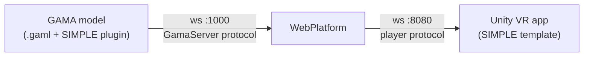

# Development Tools

The SIMPLE development tools provide the environment for building Virtual Universes. They consist of two complementary components that work together:

| Component | What it is |
|---|---|
| **GAMA Plugin** | Eclipse/Tycho Maven plugin for the GAMA platform. Adds GAML species, types, operators, and a new experiment type that connect a GAMA simulation to Unity via the WebPlatform. |
| **Unity Template VR** | A Unity 6 project template. Provides VR scenes, prefabs, and connection logic for building the student-facing VR application. |

Both components communicate through the [WebPlatform](/advanced/webplatform/architecture), which acts as the session orchestrator and relay between them.

---

## Architecture

The GAMA plugin sends simulation output (geometry positions, terrain data, messages) through the WebPlatform to Unity. Unity sends player interactions (position, expressions, ask statements) back through the WebPlatform to GAMA.

---

## GAMA Plugin

**Version**: 2.0.0 (artifact `gaml.extension.unity`). Requires GAMA 2025.06 or later.

The plugin adds:

- **`abstract_unity_linker`** — Agent species that manages the GAMA↔Unity connection. Subclass this in your model.
- **`abstract_unity_player`** — Agent species representing a VR player. Subclass for your player logic.
- **`unity` experiment type** — Automatically creates the linker. Use instead of `gui` or `batch`.
- **`unity_property`, `unity_aspect`, `unity_interaction`** — Types for defining how agents are displayed and interacted with in Unity.
- **Operators**: `prefab_aspect`, `geometry_aspect`, `geometry_properties`, `geometry_grabable`, etc.
- **Actions**: `send_world`, `add_geometries_to_send`, `move_player`, `send_message`, `update_terrain`, and more.

→ [Install the GAMA plugin](/gama/installation#simple-plugin)

→ [Full GAML API reference](/gama/api)

### Code examples

The plugin ships with 9 GAML code example models (in `models/LinkToUnity/Models/Code Examples/`) covering:

| Model | Topic |
|---|---|
| `Send Static data.gaml` | Sending geometry once at init |
| `Send Dynamic data.gaml` | Updating geometry positions each step |
| `Send Receive Messages.gaml` | Bidirectional messaging |
| `User Interaction.gaml` | Player interactions triggering GAML actions |
| `Limit Player Movement.gaml` | Invisible walls, teleport areas, movement enable/disable |
| `Send DEM.gaml` | Sending a heightfield terrain |
| `Send Water data.gaml` | Sending water surface data |
| `Manage Animation for Agents.gaml` | Controlling agent animations from GAMA |
| `Mutli player game.gaml` | Multi-player session with inter-player interactions |

### Demos

Two complete demo models are included:

- **Single-player game** (`Demo/Single Player Game/DemoModelVR.gaml`): Traffic simulation where the player can remove vehicles and reposition a static agent (tree). The player can also designate buildings as hotspots.

- **Multi-player game** (`Demo/Multi Player Game/RaceVR.gaml`): Token collection race in a maze. All players share the same environment and can see each other. Interactions between players and the environment are managed by GAMA.

---

## Unity Template VR

**Required version**: Unity `6000.3.8f1` (Unity 6 LTS). Required modules: Android Build Support, OpenJDK, Android SDK & NDK Tools.

The template provides:

- Pre-configured XR (Meta Quest) scenes for single-player and multi-player.
- A `ConnectionManager` component that connects to the WebPlatform and handles the player protocol.
- Prefabs for rendering GAMA geometries, terrain heightmaps, and water surfaces.
- Interaction prefabs: ray interactor (select/click), grab interactor, teleport.
- A `SkyViewPlayer` prefab for a god-view (top-down) perspective.

→ [Install the Unity template](/unity/installation)

→ [Unity interface basics](/unity/interface)

---

## SIMPLE Tools

The toolchain also includes two editor-level tools in Unity accessible from the **UnityVR** menu:

- **Import geometries from GAMA** — Connects to a running GAMA simulation and imports geographic geometry data as GameObjects, preserving the coordinate system.
- **Export GameObjects to GAMA** — Exports Unity GameObjects back to GAMA and saves them as shapefiles.

→ [SIMPLE Tools guide](/simple-tools/SimpleTools)

---

## Tutorials

A step-by-step tutorial builds a complete VR version of the GAMA traffic model library example, demonstrating geometry sending, player interactions, and multi-player setup.

→ [Tutorial overview](/tutorials/Tutorials)
