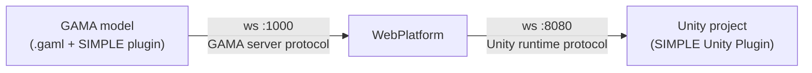

# Development Tools

The SIMPLE development environment is built around three complementary components:

| Component | What it is |
|---|---|
| **GAMA Plugin** | Adds GAML species, types, operators, and experiment support for connecting a GAMA simulation to Unity. |
| **WebPlatform** | Orchestrates sessions and relays messages between GAMA, Unity clients, and the admin UI. |
| **SIMPLE Unity Plugin** | Unity Package Manager package that adds runtime communication, editor setup tools, preview generation, and visual configuration to a Unity project. |

---


## Architecture



The GAMA plugin sends simulation output through the WebPlatform to Unity. Unity sends
player interactions, positions, executable asks, or expressions back through the
WebPlatform to GAMA.

---

## GAMA Plugin

The plugin requires GAMA 2025.06 or later.

It adds:

- **`abstract_unity_linker`**: agent species that manages the GAMA to Unity
  connection;
- **`abstract_unity_player`**: agent species representing a Unity/VR player;
- **Unity-oriented experiment support** for creating the linker automatically;
- **`unity_property`, `unity_aspect`, `unity_interaction`** for describing how agents
  are represented and interacted with in Unity;
- operators such as `prefab_aspect`, `geometry_aspect`, `geometry_properties`, and
  `geometry_grabable`;
- actions such as `send_world`, `add_geometries_to_send`, `move_player`,
  `send_message`, and `update_terrain`.

See [GAMA Installation](/gama/installation#simple-plugin) and the
[GAML API reference](/gama/api).

---

## SIMPLE Unity Plugin

Use Unity `6000.3.2f1` for the documented workflow.

The package provides:

- runtime connection to `simple.webplatform`;
- `ConnectionManager` and `SimulationManager`;
- the **GAMA Panel**;
- **Default Setup** for preparing a scene;
- **Generate Preview from GAMA** for Edit Mode visual iteration;
- species settings for prefabs, colors, scale, offsets, visibility, and dynamic color;
- optional samples for menus, code examples, and starter scenes.

Install it from Unity Package Manager:

```text
https://github.com/project-SIMPLE/SIMPLE-Unity-Plugin.git
```

See [Unity Installation](/unity/installation), [Unity Package Setup](/unity/setup),
and [Package Reference](/unity/package-reference).

---

## SIMPLE Tools

The former separate geometry import/export editor windows have been replaced in the
current Unity workflow by the GAMA Panel and runtime communication APIs:

- use **Generate Preview from GAMA** to inspect GAMA data in Unity Edit Mode;
- use species settings to tune visual representation;
- use runtime asks and expressions to send interactions back to GAMA.

See [SIMPLE Tools](/simple-tools/SimpleTools).

---

## Tutorials

The main tutorial now follows the package workflow: prepare GAMA and WebPlatform,
install the Unity package, validate Play Mode, personalize agents, generate a preview,
and configure dynamic colors.

See [Tutorial overview](/tutorials/Tutorials).
