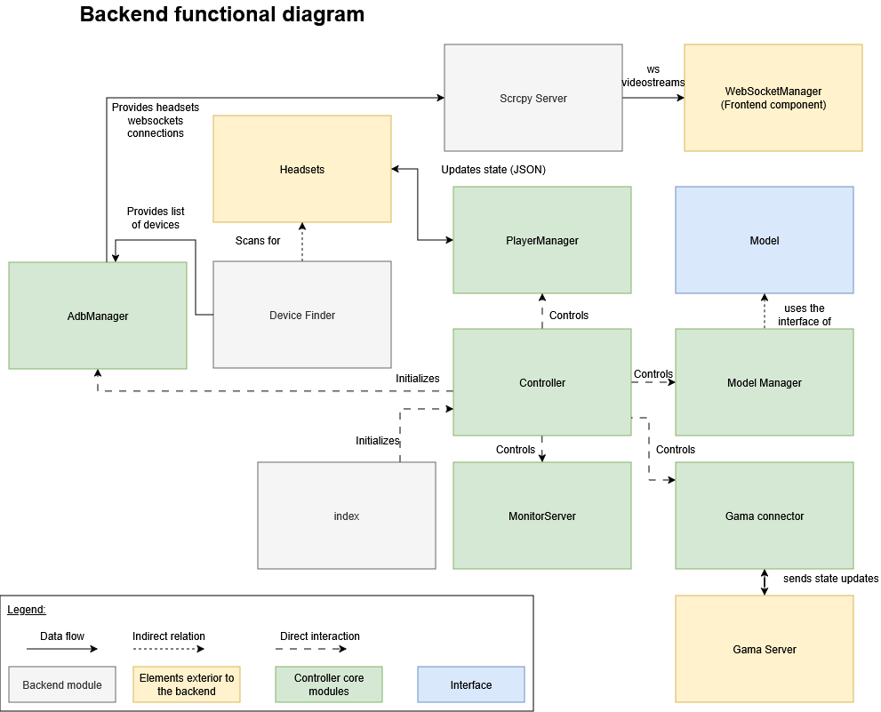

# Backend Modules of the application




####  Controller

The central component of the application is the **Core Controller**. It is responsible of the management of the 4 other components that enable the application to communicate with external modules,
and manage complex objects such as players and models.

**Responsibilities**:

- Initializes and manages lifecycle of all managers  
- Provides unified interface for frontend operations  
- Coordinates communication between managers  
- Handles cross-manager workflows

**Managed Components**:

- ModelManager  
- MonitorServer  
- PlayerManager  
- GamaConnector

**Public Methods**:

- restart: asynchronous function closing then creating new instances of the player manager, the GAMA connector, the monitor server and the model manager.

- getSimulationInformation(): public function calling the method of the model manager getCatalogListJSON, which returns a JSON element containing a set of all of the settings.json found in the folders defined by ```LEARNING_PACKAGE_PATH```, and ```EXTRA_LEARNING_PACKAGE_PATH```.

- notifyMonitor: calls the method sendMonitorGamaState, which sends a JSON message using websockets containing updates about the GAMA status, and player updates.

- broadcastSimulationOutput: sends the json_simulation to the player’s headset.

- addInGamePlayer: calls the addInGamePlayer method in the GamaConnector, that adds a player in the GAMA simulation.

- purgePlayer: function that removes a player from the application, by calling removeInGamePlayer method from the GAMA Connector, as well as the removePlayer method from the player manager.

- launchExperiment: asks the GAMA server to launch the experiment, then asynchronously waits for a response before adding all the players to the simulation by calling the addEveryPlayer method from the player manager.

- stopExperiment: stops the experiment in the GAMA server through the method “stopExperiment” called from the GAMA connector, then removes all the players from the application by calling “removeAllPlayers” from the players manager.

- pauseExperiment: asks the GAMA server to pause the experiment.

**Initialization Sequence**:   
The constructor is called in the index of the application, which initializes an instance of a Controller, which itself initializes an instance of the model manager, the monitor server, the player manager and the GAMA connector.   
if ADB is available, a new ADB manager is instantiated, then initialized. 

####   MonitorServer

**Purpose**: WebSocket server listening for frontend commands

**Responsibilities**:

- Accepts WebSocket connections from frontend  
- Parses incoming messages  
- Translates messages to Controller commands  
- Manages experiment lifecycle

**Handled Message Types**:

- Experiment control: launch, stop, pause, resume

**Port**: Configured via `WEB_APPLICATION_PORT`

###  Device Management {#7.3-device-management}

####  DeviceFinder

**Purpose**: Automatic discovery of VR headsets on network

**Library**: Evilscan v1.9.1

**Discovery Methods**:

1. **Configured IPs**: Uses `HEADSETS_IP` from environment  
2. **Network Scan**: Uses Evilscan for automatic discovery

**Scan Process**:

- Scans all IPs in configured ranges  
- Tests port 5555 first (default ADB port)  
- Then, tests ports 30000-49999  
- Loops until all IPs are connected

####  AdbManager

**Purpose**: Manages Android Debug Bridge server and connections

**Library**: yume-chan ADB v2.1.1

**Responsibilities**:

- Connection to ADB server at `127.0.0.1:5037` (default ADB address)  
- Monitors for new device connections  
- Maintains active socket connections  
- Coordinates with DeviceFinder

**Prerequisites**: ADB command must be available in system PATH

**Connection Flow**:

1. Verify ADB availability  
2. Connect to the ADB server using yume-chan ADB library  
3. Listen for device connections  
4. Establish and maintain sockets

####  PlayerManager

**Purpose**: Manages VR headset WebSocket connections and state

**Responsibilities**:

- Maintains WebSocket connections to each headset  
- Tracks connection status  
- Handles disconnections and reconnections  
- Manages player list data structure

**Player List Structure**: 

- Map associating a string representing an IP to a Player element.

**Connection Lifecycle**:

1. Initial connection establishment  
2. Active state maintenance  
3. Disconnection handling  
4. Reconnection logic

**Heartbeat Mechanism**: Heartbeat of 5000 ms by default  
**Timeout Configuration**: 

### 7.4 Video Streaming {#7.4-video-streaming}

#### 7.4.1 ScrcpyServer

**Purpose**: Generates video streams from headset screens

**Library**: yume-chan adb-scrcpy v2.1.1

**Responsibilities**:

- Creates video stream for each connected headset  
- Configures stream parameters (resolution, FPS, bitrate)  
- Applies codec selection

- 

**Stream Configuration**:

- **Resolution**: 1482px by 1570px  
- **Frame Rate**: target 30 frames per second  
- **Bitrate**: 200 bit per second  
- **Codec**: Defaults to H.265, and falls back on H.264 if the browser does not support tH.264

**Meta Quest Bug Workaround**: The yume-chan adb-scrcpy library includes a workaround for a known issue on Meta Quest 3 and 3S devices where every other frame appears black during screen mirroring. This patch is applied locally on a fixed version of the yume-chan adb-scrcpy, and is included in the initial installation of the platform. 

###   GAMA Integration {#7.5-gama-integration}

####   GamaConnector

**Purpose**: WebSocket client for GAMA platform communication

**Responsibilities**:

- Establishes WebSocket connection to GAMA server  
- Implements GAMA protocol message formatting  
- Provides high-level API for Controller  
- Handles connection errors and reconnection

**Connection Configuration**:

- **Host**: `GAMA_IP_ADDRESS` environment variable  
- **Port**: `GAMA_WS_PORT` environment variable  
- **Protocol**: Websocket

- 

**Error Handling**: throws error messages in the console as a websocket message when ENV_VERBOSE is set to true in the .env configuration file.

####  ModelManager

**Purpose**: Parses and manages GAMA simulation configurations

**Responsibilities**:

- Scans directories specified in `LEARNING_PACKAGE_PATH` and `EXTRA_LEARNING_PACKAGE_PATH`  
- Parses all `settings.json` files  
- Creates ModelList array  
- Manages active model selection  
- Provides model metadata to frontend

**Model Class Structure**:

- controller: the main Controller of the application  
- settingsPath: path to the settings.json file of the model  
- modelFilePath: path to the .gaml file of the Model

**Parsing Process**:

1. Directory traversal  
2. JSON file discovery  
3. Model object creation  
4. List compilation

###   WebSocket Management {#7.6-websocket-management}

####   WebsocketManager

**Purpose**: Creates and manages application WebSocket instances

**Created WebSockets**:

- GAMA communication socket  
- Player list management socket  
- Simulation list socket  
- Active simulation control socket

**Type Definitions**:

```
interface Player {

    id: string,  
    // Player Socket  
    ws: uWS.WebSocket\<unknown\>,  
    ping_interval: number,  
    is_alive: boolean,  
    timeout?: NodeJS.Timeout,  
    // Player State  
    connected: boolean,  
    in_game: boolean,  
    date_connection: string,  
}
```


```
interface PlayerList {

   playerList: Map\<string, Player\>;  
   associates an IP address stored as a string to a Player instance.

}
```

```
interface Simulation {  
    experiment_name: string;  
    model_file_path: string;  
    name: string;  
    player_html_file: string;  
    player_web_interface: string;  
    splashscreen: string;  
    type: string;  
    type_model_file_path: string;  
    maximal_players: string,  
    minimal_players: string,  
    selected_monitoring: string  
}
```

```
interface WebSocketContextType {  
    ws: WebSocket | null;  
    isWsConnected: boolean;  
    gama: {  
        connected: boolean;  
        loading: 'hidden' | 'visible';  
        experiment_state: string;  
        experiment_name: string;  
        content_error: string;  
    };

    playerList: PlayerList;  
    simulationList: Simulation\[\];  
    selectedSimulation: Simulation | null;

    removePlayer: (id: string) \=\> void; // Define removePlayer here

}
```

### Application Bootstrap {#7.7-application-bootstrap}

####  Index.ts

**Purpose**: Application entry point and initialization

**Responsibilities**:

- Loads environment variables from `.env`  
- Validates system dependencies (ADB availability)  
- Platform-specific configuration (Windows/Linux/macOS)  
- Configures LogTape logging system  
- Creates and initializes Controller

**Initialization Sequence**:

1. Environment variable loading  
2. System capability detection  
3. Logger configuration  
4. Controller instantiation  
5. Server startup
