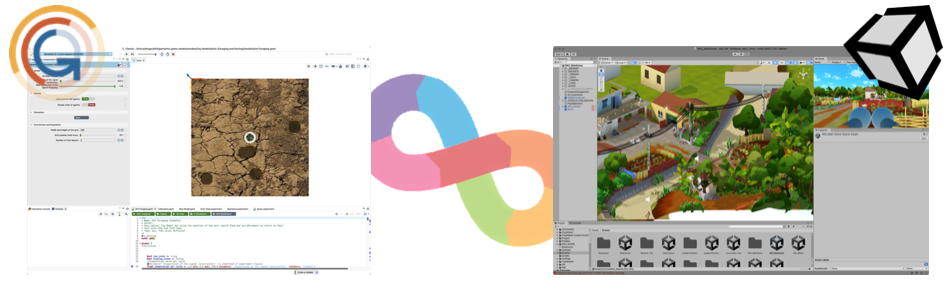
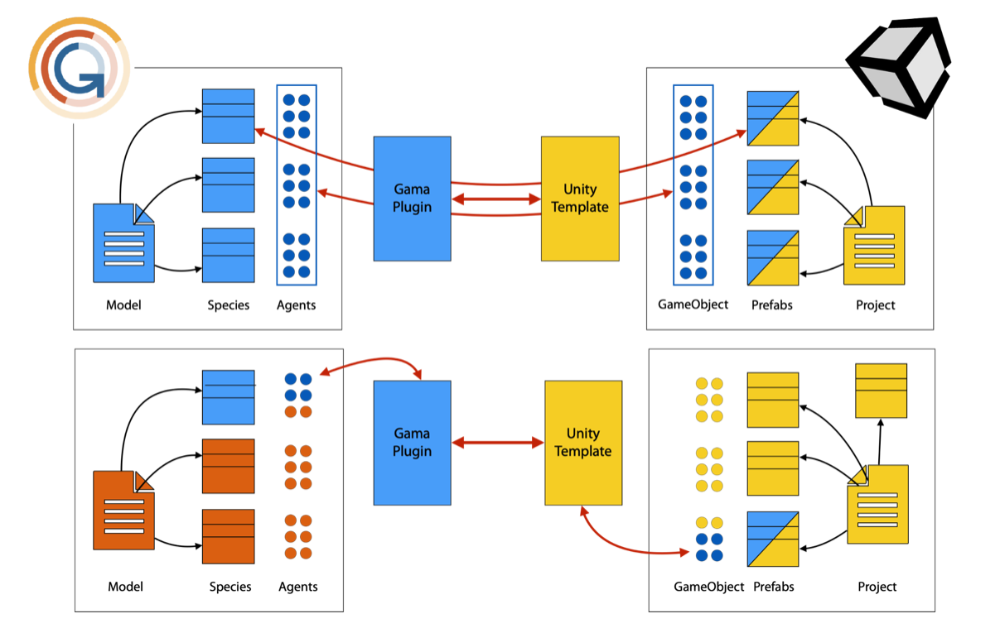
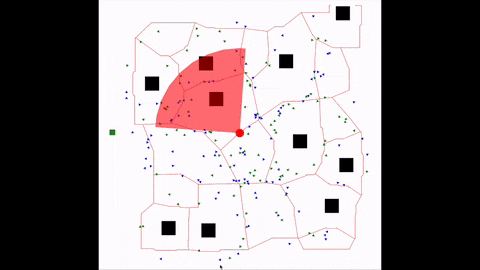
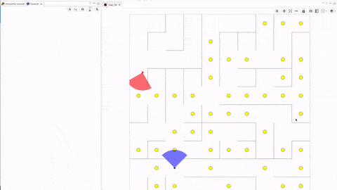

# Home

## General overview

This work is linked to the [SIMPLE Project ](https://project-simple.eu).

In these pages we describe how to use the SIMPLE development environment to build a virtual universe and couple it to a GAMA model. 

The development environment is made up of two distinct parts designed to work together: a plugin for GAMA (Unity plugin) and a package for Unity. 

The GAMA plugin integrates new agent types and a new type of experimentation, making it easy to link with Unity. It also includes tools for automatically generating a VR version of an existing GAMA model. 

The Unity package includes a set of prefabs that make it easy to build a virtual environment and link it to GAMA. It also includes tools for automatically importing and exporting geometries from/to GAMA.  

* For the installation of the Unity plugin for GAMA, see [here](https://github.com/project-SIMPLE/simple.toolchain/tree/Unity-6/GAMA%20Plugin).
* For the installation of the SIMPLE Unity template, see [here](https://github.com/project-SIMPLE/simple.toolchain/tree/Unity-6/Unity%20Template%20VR#simple-unity-template)

The GAMA plugin and Unity template include code examples to link GAMA and Unity, as well as 2 demos showing complete examples of virtual universes.

The documentation concerning the execution of models can be found [here](https://github.com/project-SIMPLE/simple.toolchain/wiki/01-Running-a-model-game).

Information regarding the web platform that can be used to bridge the connection between a Unity application and a GAMA server can be found [here](https://doc.project-simple.eu/)

## Code Example models

9 code examples are provided to illustrate the use of different functions: 
* Send Receive Messages.gaml: shows how to send and receive a message from Unity. This model works with the "Assets/Scenes/Code Example/Send Receive Message" scene in the Unity template.
* Send Static data.gaml: Shows how to send static geometries/agents to Unity, i.e. agents/geometries that are only sent on initialization and not updated afterwards. This model works with the "Assets/Scenes/Code Example/Receive Static Data" scene in the Unity model.
* Send Dynamic data.gaml: Shows how to dynamically send geometries/agents to Unity, i.e. whose location/geometry is sent back to Unity at each time step. It shows as well how to send attributes values from GAMA to Unity linked to the different geometries/agents. This model works with the "Assets/Scenes/Code Example/Receive Dynamic Data" scene in the Unity model.
* User Interaction.gaml: Shows how to define user interactions in Unity and interact with the GAMA simulation. This model works with the "Assets/Scenes/Code Example/User Interactions" scene in the Unity model.
* Limit Player Movement.gaml: Show how to limit the player movement in Unity: enable/disable the player movement, building invisible walls, defining a specific teleportation area. It works with the Scene "Assets/Scenes/Code Example/Limit Player Movement" from the Unity Template
* Send DEM.gaml: Show how to send a grid/matrix to Unity and modify it on the fly. It works with the Scene "Assets/Scenes/Code Example/Receive DEM Data" from the Unity Template.
* Send Water data.gaml: Show how to send water data to Unity and modify it on the fly. It works with the Scene "Assets/Scenes/Code Example/Receive Water Data" from the Unity Template.
* Manage Animation for Agents.gaml: Show how to manage the animation of an agent in Unity from GAMA. It works with the Scene "Assets/Scenes/Code Example/Manage Anmation for Agents" from the Unity Template.
* Mutli player game.gaml: Show how to define a simple multi-player game, with interactions between the players, in Unity. It works with the Scene "Assets/Scenes/Code Example/Multi-player" from the Unity Template. 
 

## Demo models

2 demos are provided to illustrate complete VR experiences.

* Demo/Single Player Game/DemoModelVR.gaml: demonstration of a single-player VR experience. In this demo, the player can see cars and motorcycles sent by GAMA. Clicking on a car or motorcycle removes it from the simulation. The player can also see blocks. If the player clicks on a block, it turns red and becomes a hotspot (vehicles will try to drive near this hotspot). Finally, the player can see a tree (static_agent) and move it (grab). The tree's position will be updated accordingly in the GAMA simulation. This demonstration works with the Unity Template's "Assets/Scenes/Single Player Game/Main Scene" (Scenes to use: Startup Menu, IP Menu, Single Player Game/Main Scene).

* Demo/Multi Player Game/RaceVR.gaml: demonstration of a multiplayer VR experience. In this demo, players have to collect as many tokens as possible (treasure chest) in a maze. The player who collects the most tokens is the winner. All the players are playing in the same environment and they can see the other players. Interactions between players and the environment are managed by GAMA. This demonstration works with the "Assets/Scenes/Multi Player Game/Main Scene" of the Unity model (Scenes to use: Startup Menu, IP Menu, Multi Player Game/Main Scene, End of Game Menu). 

## Tutorial

We offer a complete tutorial to illustrate how to build a complete virtual environment with interactions from an existing GAMA model. In this tutorial, we start with the traffic model included in the GAMA model library. In this model, vehicles (car) travel on a road network from building to building. The greater the number of vehicles on a road relative to its capacity, the slower the vehicles will move along the road. In addition, each vehicle emits pollutants into the air. The VR version we propose in this tutorial allows you to navigate with a manager's view of the world and to close/open roads. 

The tutorial can be found [here](https://github.com/project-SIMPLE/simple.toolchain/wiki/02-Tutorial-%E2%80%90-From-GAMA-model-to-Virtual-Universe-%E2%80%90-case-of-a-traffic-model)

