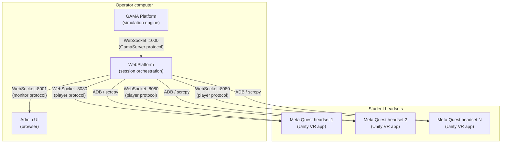

# SIMPLE — Technical Overview

SIMPLE is a research-grade toolchain for deploying synchronized multi-user VR classroom sessions. It lets researchers and educators run GAMA agent-based simulations that students experience simultaneously through Meta Quest VR headsets, with a web-based control panel for the session operator.

The project is developed at IRD (Institut de Recherche pour le Développement), UMMISCO lab, under the ACROSS program. It is co-funded by the European Union.

---

## System architecture

A SIMPLE session connects three software layers:

| Component | Role |
|---|---|
| **GAMA platform** | Runs the `.gaml` simulation model. Exposes a WebSocket server (port 1000 by default). |
| **WebPlatform** | Central hub. Acts as a WebSocket client toward GAMA and as a WebSocket server toward headsets and the admin UI. Also serves the admin UI as a static web app. |
| **Admin UI** | Browser-based control panel. Operators select simulations, launch/stop/pause experiments, and monitor headset streams. |
| **Unity VR app** | The student-facing VR application. Built from the SIMPLE Unity template, it connects to the WebPlatform and renders the simulation in VR. |

---

## Components

### WebPlatform

The WebPlatform (`simple.webplatform/`) is a Node.js application. It:

- Connects to GAMA as a WebSocket client and relays simulation output to headsets.
- Acts as a WebSocket server for VR headsets (port `HEADSET_WS_PORT`, default 8080).
- Acts as a WebSocket server for the admin UI (port `MONITOR_WS_PORT`, default 8001).
- Serves the React admin UI as static files (port `WEB_APPLICATION_PORT`, default 8000).
- Manages ADB connections to Meta Quest headsets for screen mirroring via scrcpy.
- Controls an APC UPS for the M2L2 portable classroom deployment.

The WebPlatform ships as a self-contained executable (Linux, Windows, macOS x64) that bundles both the Node.js backend and the compiled frontend.

See the [WebPlatform section](/advanced/webplatform/architecture) for full details.

### GAMA Plugin

The GAMA plugin (`simple.toolchain/GAMA Plugin/`) extends the GAMA platform with:

- Two abstract species: `abstract_unity_linker` and `abstract_unity_player`.
- A new experiment type: `VR_Experiment`, that instantiates a linker automatically.
- Three new GAML types: `unity_property`, `unity_aspect`, `unity_interaction`.
- Operators and actions for sending geometries, terrain, water data, messages, and player movement to Unity.

Plugin version: **2.0.0** (artifact `gaml.extension.unity`). Requires GAMA ≥ 2025-01.

See the [GAMA Plugin section](/toolchain/01-Home) for installation and the [GAML API reference](/toolchain/gaml-api) for the full API.

### Unity Template

The Unity template (`simple.toolchain/Unity Template VR/`) is a Unity 6 project (version `6000.3.8f1`) that provides:

- Pre-configured VR scenes for single-player and multi-player experiences.
- A `ConnectionManager` component that connects to the WebPlatform.
- Prefabs for receiving geometry, terrain, water, and agent animation data from GAMA.
- Interaction prefabs (grab, select, teleport).
- Code example scenes matching each GAML code example model.

See the [Unity template guide](/toolchain/Unity-Installation-Guide) for setup.

---

## Virtual Universes

A **Virtual Universe (VU)** is the combination of a GAML model file and a Unity scene that together form one deployable simulation experience. VUs are distributed as folders containing:

- A GAML model (`.gaml` file).
- A `settings.json` descriptor that the WebPlatform reads.
- A Unity APK (pre-built for Meta Quest) or Unity project for custom builds.
- Optional assets (maps, shapefiles, textures).

The WebPlatform scans the `learning-packages/` directory for `settings.json` files and presents found VUs in the admin UI.

See [Virtual Universe settings reference](/virtual-universes/settings) for the `settings.json` format.

---

## M2L2 — Portable Classroom

M2L2 is a portable classroom-in-a-box hardware kit built around Mac minis, Meta Quest headsets, a WiFi access point, and an APC UPS. The WebPlatform integrates UPS monitoring and a 3-hour session timer that cleanly shuts down all headsets and the host computer when running on battery.

---

## Where to go next

| Goal | Page |
|---|---|
| Set up the full dev stack | [Quick Start](/getting-started/01-quick-start) |
| Install prerequisites (GAMA, plugin, Node.js, Unity) | [Prerequisites](/getting-started/02-dependencies) |
| Install the WebPlatform | [Install the WebPlatform](/getting-started/03-web-platform) |
| Set up the Unity template | [Unity Template Setup](/getting-started/05-unity-setup) |
| Set up the Unity template | [Unity Installation Guide](/toolchain/Unity-Installation-Guide) |
| Configure environment variables | [Environment Reference](/advanced/webplatform/env-reference) |
| Understand the WebSocket protocol | [WebSocket API Reference](/advanced/webplatform/websocket-api) |
| Browse the GAML API | [GAML API Reference](/toolchain/gaml-api) |
